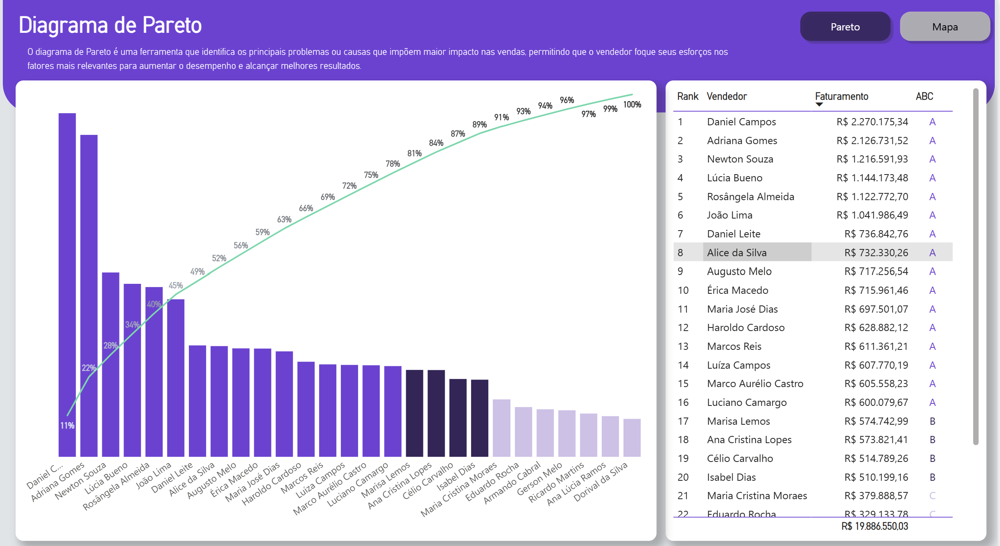

  
  

    <h2>Olá, sou a Ana Júlia Kucharski 👋</h2>
    

      Estudante de Ciência de Dados para Negócios. Aqui apresento meus projetos práticos focados em análise de dados, criação de dashboards e automação de processos para apoio à tomada de decisão.
    

  

---

## 🧠 Sobre Mim

- 🎓 Graduanda em Ciência de Dados para Negócios na FAE Centro Universitário.
- 📊 Experiência prática na estruturação de bases, análise exploratória e visualização de dados com Python, R e Power BI.
- 🛠️ Interesse voltado para a aplicação da ciência de dados na resolução de problemas operacionais e de gestão.

---

## 🚀 Meus Projetos

  
  <h3>📱 Inserção e Acompanhamento de Projetos</h3>
  
Aplicação no Power Apps integrada ao Power BI para padronizar a rotina de registro e monitorar o progresso dos projetos em tempo real. Desenvolvido em power plataforms

  <a href="https://github.com/anajuliakucharski/seu-repositorio-powerapps" target="_blank">🔗 Ver no GitHub</a>

  
  <h3>🌐 Pareto & Faturamento — Dashboard Interativo</h3>
  
Análise visual para identificação de gargalos operacionais via Diagrama de Pareto aliada ao mapeamento geográfico de faturamento.

  <a href="https://github.com/anajuliakucharski/projeto-dashboard" target="_blank">🔗 Ver no GitHub</a>

  
  <h3>📊 Análise Financeira no Mercado de Games</h3>
  
Estudo exploratório de dados da bolsa de valores focados em empresas do universo de jogos digitais utilizando Python e R.

  <a href="https://github.com/anajuliakucharski/projeto-exemplo" target="_blank">🔗 Ver no GitHub</a>

---

## 🎓 Formação

- **Bacharelado em Ciência de Dados para Negócios — FAE Centro Universitário** (2023–2026)
  - Formação focada na união entre estatística, programação e contexto de negócios. Aplicação prática de Python, R e SQL na construção de pipelines de dados, modelagem preditiva e geração de métricas estratégicas.
- **Bacharelado em Administração — FAE Centro Universitário** (2026-2027)
---

## 🛠️ Habilidades Técnicas

- **Linguagens:** Python, R, SQL
- **Visualização e Low-Code:** Power BI, Power Apps, Tableau, Quarto
- **Outras Ferramentas:** Git, GitHub, Excel Avançado

---

## 📫 Contato

- 📧 Email: [ana.kucharski@outlook.com](mailto:ana.kucharski@outlook.com)
- 💼 [LinkedIn](https://www.linkedin.com/in/anakucharski/)
- 🟣 [GitHub](https://github.com/anajuliakucharski)

---